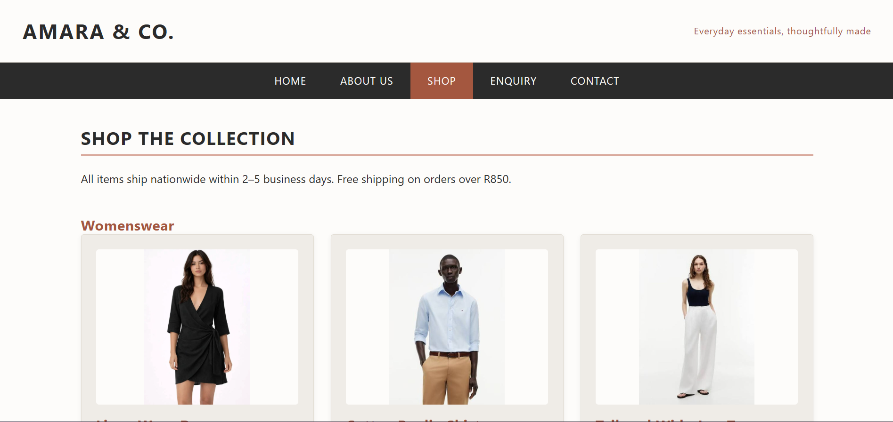
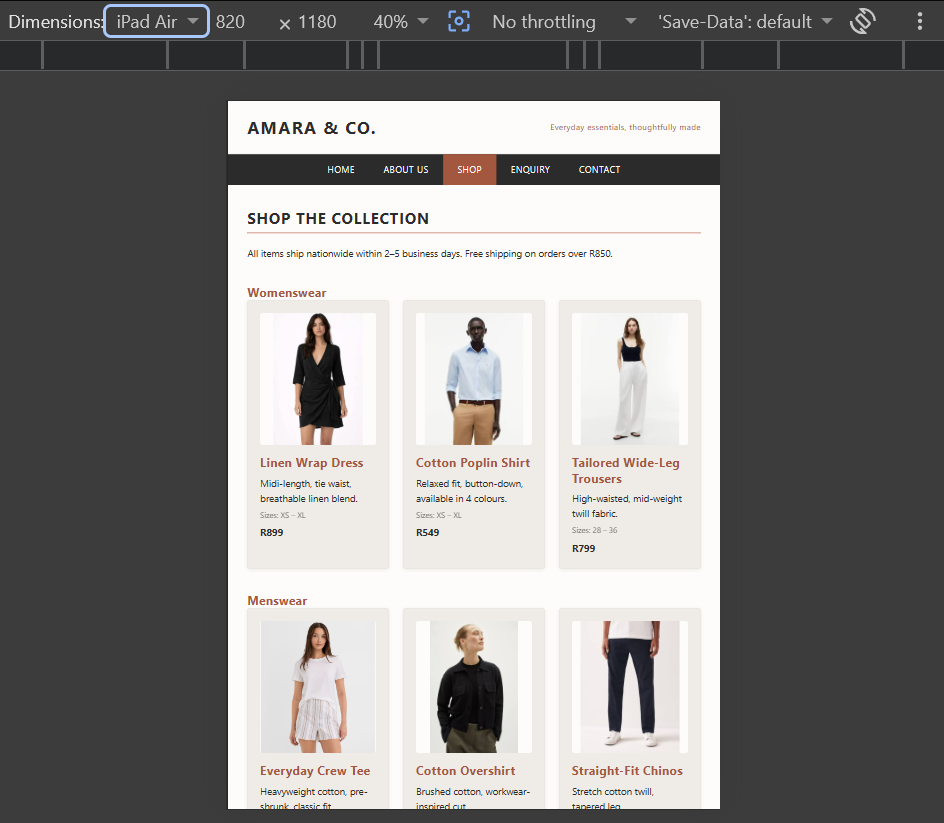
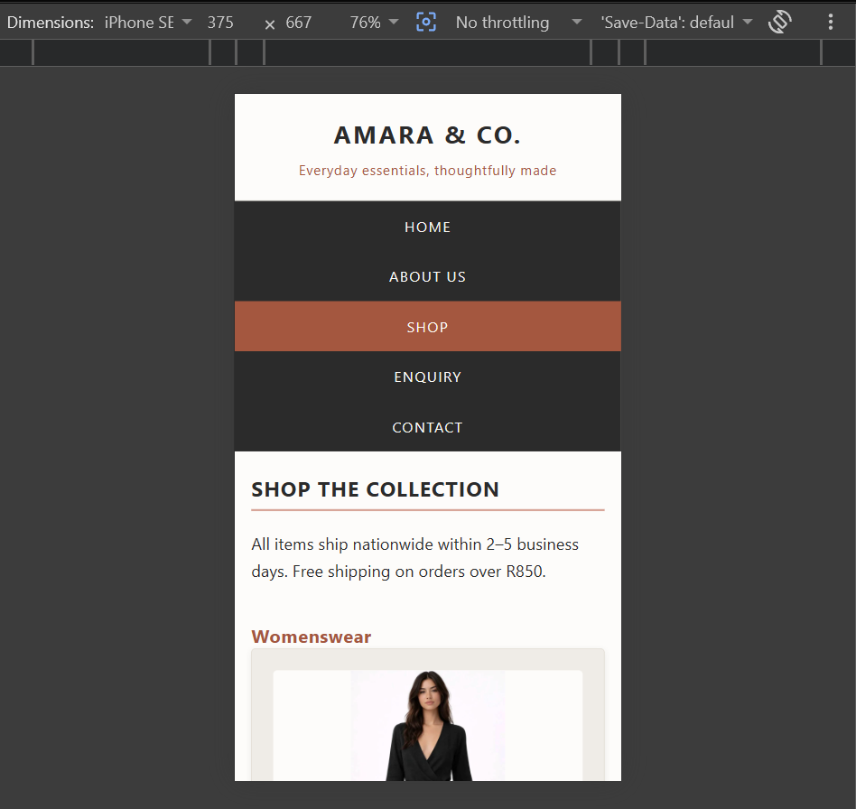

# Amara & Co.

## Student Information

- **Student Name:** [Insert your full name]
- **Student Number:** [Insert your student number]
- **Module:** Web Development (Introduction)
- **Module Code:** WEDE5020
- **Year:** 2026

## Project Overview

Amara & Co. is a fictional South African clothing retail business offering everyday clothing and accessories. The website is a responsive five-page website that provides information about the organisation, its products, enquiry options and contact information.

The website consists of the following pages:

- Home — `index.html`
- About Us — `about.html`
- Shop — `products.html`
- Enquiry — `enquiry.html`
- Contact — `contact.html`

The website was developed using HTML5, CSS3 and JavaScript. Responsive web design techniques were implemented for desktop, tablet and mobile screen sizes.

## Target Audience

The target audience consists of South African consumers interested in everyday clothing and accessories.

The website is designed for users who value:

- Comfortable everyday clothing.
- Practical and versatile products.
- Clear product information.
- Simple navigation.
- Responsive browsing.
- Enquiry and contact options.

## Website Goals and Objectives

The goals and objectives of the website are to:

- Present Amara & Co. as a professional clothing retailer.
- Provide information about the organisation.
- Display clothing and accessories clearly.
- Allow visitors to search for products.
- Provide an enquiry process.
- Allow visitors to contact the organisation.
- Provide a responsive and user-friendly experience.
- Improve online visibility through SEO.
- Provide internal navigation and calls to action.

### Key Performance Indicators

Website success can be measured through:

- Website visits and page views.
- Product searches.
- Product image interactions.
- Enquiry form submissions.
- Contact form submissions.
- User interaction with the website.
- Successful navigation between pages.
- Desktop, tablet and mobile usability.
- Search engine visibility.

## Key Features and Functionality

The website includes:

- Five interconnected HTML pages.
- Consistent navigation.
- Semantic HTML5 structure.
- An external CSS stylesheet.
- CSS Grid and Flexbox layouts.
- Responsive desktop, tablet and mobile layouts.
- Responsive navigation.
- Responsive typography.
- Responsive product images.
- `srcset` and `sizes` attributes.
- `<picture>` elements.
- Product search functionality.
- Dynamic product filtering.
- Product image gallery and lightbox functionality.
- JavaScript DOM manipulation.
- An interactive map.
- Multiple contact locations.
- An enquiry form.
- A contact form.
- HTML5 form validation.
- JavaScript form validation.
- Validation error messages.
- Form processing and responses.
- AJAX form submission.
- SEO title tags.
- Meta descriptions.
- Meta keywords.
- Structured headings.
- Descriptive image filenames.
- Image `alt` text.
- Internal links.
- `robots.txt`.
- `sitemap.xml`.
- Page-speed optimisation.
- Basic security considerations.

## Website Pages

### Home — `index.html`

The homepage introduces Amara & Co. and provides visitors with an overview of the organisation and links to the main areas of the website.

### About Us — `about.html`

The About Us page provides information about the organisation, including its background, mission, vision and values.

### Shop — `products.html`

The Shop page displays the available products.

#### Womenswear

- Linen Wrap Dress.
- Cotton Poplin Shirt.
- Tailored Wide-Leg Trousers.

#### Menswear

- Everyday Crew Tee.
- Cotton Overshirt.
- Straight-Fit Chinos.

#### Accessories

- Canvas Tote Bag.
- Woven Belt.

The Shop page includes product search functionality, responsive product images and an interactive image lightbox.

### Enquiry — `enquiry.html`

The Enquiry page contains a form that allows visitors to submit product and service enquiries.

The form includes validation and provides a response after successful processing.

### Contact — `contact.html`

The Contact page provides contact information and an interactive map containing multiple locations.

It also includes a general contact form that allows visitors to submit messages to the organisation.

## File and Folder Structure

```text
Heather/
├── index.html
├── about.html
├── products.html
├── enquiry.html
├── contact.html
├── README.md
├── robots.txt
├── sitemap.xml
├── css/
│   └── style.css
├── js/
│   └── script.js
└── images/
    ├── Canvas Tote Bag large.jpg
    ├── Canvas Tote Bag medium.jpg
    ├── Canvas Tote Bag small.jpg
    ├── Cotton Overshirt1 large.jpg
    ├── Cotton Overshirt1 medium.jpg
    ├── Cotton Overshirt1 small.jpg
    ├── Cotton Poplin Shirt large.jpg
    ├── Cotton Poplin Shirt medium.jpg
    ├── Cotton Poplin Shirt small.jpg
    ├── Everyday Crew Tee large.jpg
    ├── Everyday Crew Tee medium.jpg
    ├── Everyday Crew Tee small.jpg
    ├── Linen Wrap Dress large.jpg
    ├── Linen Wrap Dress medium.jpg
    ├── Linen Wrap Dress small.jpg
    ├── Straight-Fit Chinos large.jpg
    ├── Straight-Fit Chinos medium.jpg
    ├── Straight-Fit Chinos small.jpg
    ├── Tailored Wide Leg Trousers large.jpg
    ├── Tailored Wide Leg Trousers medium.jpg
    ├── Tailored Wide Leg Trousers small.jpg
    ├── Woven Belt large.jpg
    ├── Woven Belt medium.jpg
    └── Woven Belt small.jpg
```

## Part 1 — Building the Foundation

The Part 1 foundation work included:

- Organisation selection.
- Project planning.
- Target audience identification.
- Website goals and objectives.
- Content research and sourcing.
- Website sitemap.
- File and folder organisation.
- Five HTML pages.
- Semantic HTML5 structure.
- Header.
- Navigation.
- Main content.
- Footer.
- Images and website content.
- Internal page navigation.
- HTML comments.
- Consistent code formatting.

The initial structure established the website pages, navigation and content required for the Amara & Co. website.

## Part 2 — CSS and Responsive Design

The Part 2 CSS and responsive design work included:

- Corrections to the Part 1 work.
- External `css/style.css`.
- CSS reset.
- Base styles.
- Typography.
- Colour scheme.
- Spacing.
- CSS Grid.
- Flexbox.
- Product card styling.
- Borders and shadows.
- Button styling.
- Navigation styling.
- `:hover` effects.
- `:focus` effects.
- `:active` effects.
- Responsive breakpoints.
- Desktop layout.
- Tablet layout.
- Mobile layout.
- Responsive typography.
- Responsive navigation.
- Responsive images.
- `srcset`.
- `sizes`.
- `<picture>`.
- Desktop, tablet and mobile testing.
- Desktop, tablet and mobile screenshot evidence.

### Responsive Screenshots

#### Desktop



#### Tablet



#### Mobile



Responsive design was implemented using:

- Media queries.
- Desktop, tablet and mobile breakpoints.
- Relative units.
- CSS Grid.
- Flexbox.
- Responsive typography.
- Responsive navigation.
- Responsive images.
- `srcset`.
- `sizes`.
- `<picture>`.

## Part 3 — JavaScript, SEO and Deployment

The Part 3 work included:

- Corrections to the Part 2 work.
- JavaScript functionality.
- DOM manipulation.
- Interactive elements.
- Interactive map.
- Gallery lightbox.
- Dynamic product functionality.
- Product search.
- SEO implementation.
- Title tags.
- Meta descriptions.
- Meta keywords.
- Heading structure.
- Image optimisation.
- Image `alt` text.
- Internal links.
- Mobile-friendly design.
- `robots.txt`.
- `sitemap.xml`.
- Page-speed optimisation.
- Basic security considerations.
- Enquiry form.
- Contact form.
- HTML5 validation.
- JavaScript validation.
- Validation error messages.
- Form processing.
- AJAX form submission.
- Contact email functionality.
- Website deployment.

## JavaScript Functionality

JavaScript functionality was used for:

- DOM manipulation.
- Product search.
- Dynamic product filtering.
- Product image lightbox.
- Interactive website elements.
- Form validation.
- Validation error messages.
- Enquiry form processing.
- Contact form processing.
- AJAX form submission.
- Interactive map functionality.

## Forms

### Enquiry Form

The enquiry form allows visitors to submit enquiries about products and services.

The form includes:

- Text input fields.
- Appropriate form controls.
- Required fields.
- HTML5 validation.
- JavaScript validation.
- Error messages.
- Input processing.
- A response after successful processing.
- AJAX form submission.

### Contact Form

The contact form allows visitors to submit general messages to the organisation.

The form includes:

- Contact information fields.
- Message type selection.
- A message textarea.
- Required fields.
- HTML5 validation.
- JavaScript validation.
- Validation error messages.
- Input processing.
- Email functionality.
- AJAX form submission.

## SEO

The website implements the following SEO features:

- Unique title tags for pages.
- Meta descriptions.
- Meta keywords.
- Structured heading hierarchy.
- Descriptive image filenames.
- Descriptive `alt` text.
- Internal links.
- Mobile-friendly responsive design.
- Clean page URLs.
- `robots.txt`.
- `sitemap.xml`.
- Image optimisation.
- Page-speed considerations.

## Sitemap

The website structure is:

```text
Amara & Co.
├── Home
│   └── index.html
├── About Us
│   └── about.html
├── Shop
│   └── products.html
├── Enquiry
│   └── enquiry.html
└── Contact
    └── contact.html
```

The XML sitemap is contained in:

```text
sitemap.xml
```

## Project Timeline and Milestones

| Phase | Milestones |
|---|---|
| Part 1 | Planning, research, content gathering and HTML structure |
| Part 1 | Five-page website structure and navigation |
| Part 2 | External CSS stylesheet and desktop styling |
| Part 2 | Responsive design and responsive images |
| Part 2 | Desktop, tablet and mobile testing |
| Part 3 | JavaScript functionality |
| Part 3 | Product search and dynamic content |
| Part 3 | Image gallery and lightbox |
| Part 3 | Forms and JavaScript validation |
| Part 3 | SEO implementation |
| Part 3 | `robots.txt` and `sitemap.xml` |
| Final | Testing, documentation and deployment |

## GitHub and Version Control

Git was used to track changes to the website throughout development.

The project was developed through multiple stages using a local Git repository and pushed to the GitHub repository:

[Amara & Co. GitHub repository](https://github.com/CodeBroke33/Heather)

Descriptive commit messages were used to document development progress and project changes.

## Testing

The website was tested across desktop, tablet and mobile screen sizes.

Testing included:

- Navigation links.
- Page loading.
- Product search.
- Product filtering.
- Product image lightbox.
- JavaScript functionality.
- Interactive map.
- Enquiry form.
- Contact form.
- HTML5 validation.
- JavaScript validation.
- Form error messages.
- Form processing.
- Responsive layouts.
- Responsive images.
- Internal links.
- SEO files.
- `robots.txt`.
- `sitemap.xml`.
- Browser compatibility.
- Overall page functionality.

## Deployment

- **Deployment platform:** [Insert the platform used]
- **Live website:** [Insert the deployed website URL]
- **GitHub repository:** [Amara & Co. GitHub repository](https://github.com/CodeBroke33/Heather)

## Changelog

### Part 1 — Building the Foundation

- Created the Amara & Co. website project.
- Created the five required HTML pages.
- Created the main website navigation.
- Added semantic HTML5 structure.
- Added header, navigation, main content and footer sections.
- Added organisation and product content.
- Added product imagery.
- Created the `css`, `js` and `images` folders.
- Established consistent file naming.
- Added comments to the HTML code.
- Created the initial README documentation.
- Created the initial sitemap structure.

### Part 2 — CSS and Responsive Design

- Corrected the Part 1 website work.
- Added the external `css/style.css` stylesheet.
- Linked the stylesheet to all HTML pages.
- Added CSS reset and base styles.
- Added typography styles.
- Added the website colour scheme.
- Implemented CSS Grid and Flexbox.
- Styled navigation and page layouts.
- Styled product cards.
- Added borders, shadows and decorative elements.
- Added `:hover`, `:focus` and `:active` states.
- Added desktop responsive styling.
- Added tablet responsive styling.
- Added mobile responsive styling.
- Adjusted typography for different screen sizes.
- Adjusted navigation for different screen sizes.
- Implemented responsive images.
- Added `srcset` and `sizes`.
- Implemented the `<picture>` element.
- Tested desktop, tablet and mobile layouts.
- Added desktop, tablet and mobile screenshot evidence.
- Updated the README with Part 2 information.

### Part 3 — JavaScript, SEO and Deployment

- Corrected the Part 2 website work.
- Added JavaScript functionality.
- Implemented DOM manipulation.
- Added interactive website elements.
- Added the product image lightbox.
- Added dynamic product search.
- Added product filtering.
- Added interactive map functionality.
- Added form validation.
- Added HTML5 validation attributes.
- Added JavaScript validation.
- Added validation error messages.
- Added enquiry form processing.
- Added enquiry response functionality.
- Added contact form processing.
- Added contact email functionality.
- Added AJAX form submission.
- Added SEO title tags.
- Added meta descriptions.
- Added meta keywords.
- Improved heading hierarchy.
- Improved image filenames.
- Added descriptive image `alt` text.
- Added internal links.
- Created `robots.txt`.
- Created `sitemap.xml`.
- Applied page-speed optimisation.
- Applied basic security considerations.
- Completed responsive and functionality testing.
- Updated the README with Part 3 information.
- Updated the references.
- Prepared the website for final deployment and submission.

## References

The following references were used during the development of the project and are presented using the Harvard Style Referencing Guide adapted for The Independent Institute of Education:

- Google Search Central (2026) *SEO Starter Guide*. Available at: <https://developers.google.com/search/docs/fundamentals/seo-starter-guide> (Accessed: 11 August 2026).

- Google Search Central (2026) *Sitemaps overview*. Available at: <https://developers.google.com/search/docs/crawling-indexing/sitemaps/overview> (Accessed: 11 August 2026).

- Mozilla Developer Network (MDN) (2026) *CSS: Cascading Style Sheets*. Available at: <https://developer.mozilla.org/en-US/docs/Web/CSS> (Accessed: 11 August 2026).

- Mozilla Developer Network (MDN) (2026) *HTML: HyperText Markup Language*. Available at: <https://developer.mozilla.org/en-US/docs/Web/HTML> (Accessed: 11 August 2026).

- Mozilla Developer Network (MDN) (2026) *JavaScript*. Available at: <https://developer.mozilla.org/en-US/docs/Web/JavaScript> (Accessed: 11 August 2026).

- World Wide Web Consortium (W3C) (2026) *Web Standards*. Available at: <https://www.w3.org/standards/> (Accessed: 11 August 2026).